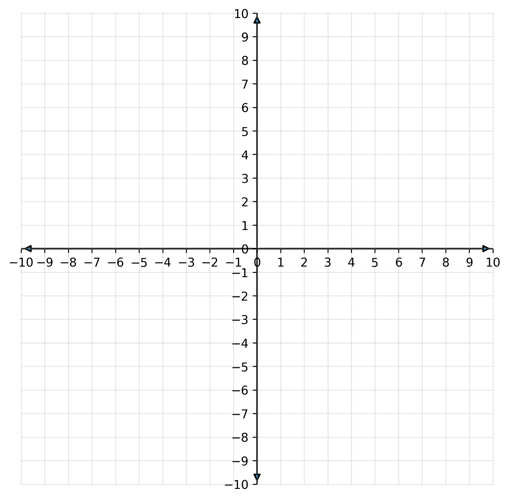

# Algebra 1 – Q4.1_4.3 B

**Name: ____________________________**

## 4.1 – Graphing Function Rules

**Find the value of $y$ for each function rule. Show your work.**

1. $y = -4x + 9$ when $x = 2$ 
     

2. $f(x) = 5x - 1$ when $x = -4$
     

3. $y = \dfrac{3}{2}x - 3$ when $x = 6$ 
     

**Complete the table of values and graph the line.**

4. $y = 2x - 5$
 
:::{layout-ncol=2}

:::{.diagram}
|  x  |  y  |
| --- | --- |
| -2  |     |
| 2   |     |
:::

:::{.diagram}
{width="300px" fig-align="center"}
:::

:::

## 4.2 – Understanding Slope

**Find the slope. Show your work.**

5. Points: $(1, -2)$ and $(7, 4)$ 
        

6. Points: $(-5, -3)$ and $(3, 9)$ 
        

**Tell whether the slope is positive, negative, zero, or undefined.**

7. A line falling left to right. 
        

8. A horizontal line through $y = 6$. 
        

9. A vertical line through $x = -11$.
    

## 4.3 – The Equation of a Line

**Graph the line using the given point and slope.**

10. Through $(3, -1)$ with slope $m = \dfrac{2}{3}$

{width="300px" fig-align="center"}

  

11.  Through $(-2, 5)$ with slope $m = -4$

{width="300px" fig-align="center"}

**Find the x- and y-intercepts. Show your work.**

12. $y = 4x - 12$ 
         

13. $5x - 10y = 20$ 
         

**Real-World Problem**

14.  A rental shop charges a flat fee of $\$12$ plus $\$3$ per hour for use of a bike.
    If you paid $\$39$, how many hours did you rent the bike?
