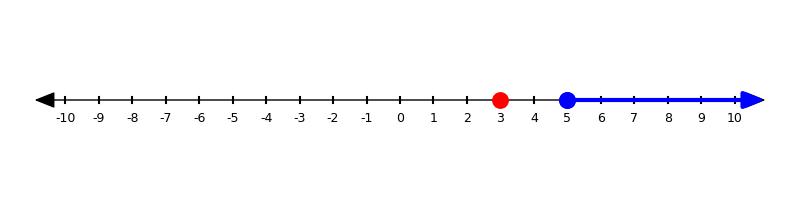
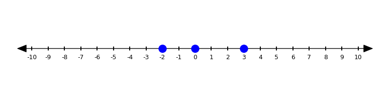

# 📚 Glossary {.unnumbered}

### absolute value {#glossary-absolute-value}

The distance a number is from zero on a number line, always expressed as a positive number or zero.

> Example: The **absolute value** of `-7` is `7`.

---

### greater than (**&gt;**) {#glossary-greater-than}

A number is greater than another number if it is further to the right on the number line.

> Example $5 > 3$ is true
> {#fig-number-line width="100%"}
> but $3 > 5$ is false
> {#fig-number-line width="100%"}

---

### integer {#glossary-integer}

In mathematics, an integer is a whole number (not a fraction or decimal) that can be positive, negative, or zero. Examples include -3, 0, 5, and 100. 

---

### less than (**&lt;**) {#glossary-less-than}

A number is less than another number if it is further to the left on the number line.

> Example $3 < 5$ is true
> {#fig-number-line width="100%"}
> but $5 < 3$ is false
> {#fig-number-line width="100%"}

---

### number line {#glossary-number-line}

A straight line used to represent numbers in order. It usually has zero in the middle, with positive numbers to the right and negative numbers to the left. Number lines help visualize operations and compare values.

> Example: $-2$, $0$, and $3$ are all on the number line.
> {#fig-number-line width="100%"}

---

### negative number {#glossary-negative-number}

A number less than zero. On a number line, negative numbers are to the left of zero.

> Example: `-4` is a **negative number**.

---

### opposite {#glossary-opposite}

Two numbers that are the same distance from zero on a number line, but on opposite sides. Their sum is always zero.

> Example: `-3` and `3` are **opposite** numbers.

---

### positive number {#glossary-positive-number}

A number greater than zero. On a number line, positive numbers are to the right of zero.

> Example: `5` is a **positive number**.

---
