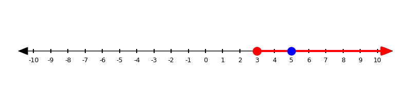
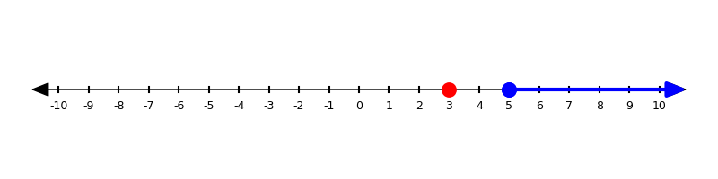
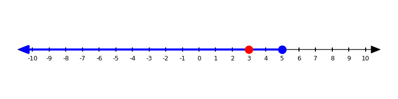
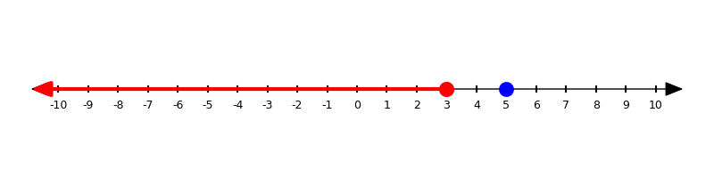
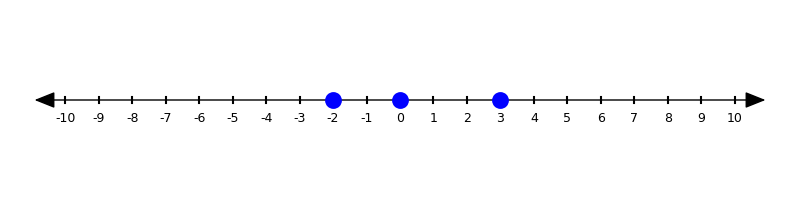

# Glossary {.unnumbered}

### Absolute value {#glossary-absolute_value}

The distance a number is from zero on a number line, always expressed as a positive number or zero.

> **Example:**
>
> The **absolute value** of `-7` is `7`.

**See Also:** 

---

### Addition {#glossary-addition}

An operation that combines two or more numbers into a total. Also called "plus".

> **Example:**
>
> $5 + 7 = 12$

**See Also:** , , , , 

---

### Algebra {#glossary-algebra}

Algebra is a branch of math that uses letters and symbols to represent numbers and relationships.

It lets us describe patterns, write rules, and solve problems that work in many different situations.

---

### All Real Numbers {#glossary-all-real-numbers}

When we say the solution to an equation is **all real numbers**, it means that *any number you plug in will make the equation true*. This usually happens when both sides of the equation are exactly the same after simplifying.

To save space and make their answers more clear, mathematicians like to use $\mathbb{R}$ in place of the words "all real numbers" or "infinitely many solutions".

> **Example:**
> $2(x + 3) = 2x + 6$
> simplifies to $2x + 6 = 2x + 6$, which is always true.
> The solution is **all real numbers**.

**See Also:** 

---

### Area Model {#glossary-area-model}

An **area model** (or "box method") is a visual way to organize multiplication by breaking each number or expression into parts.

In an area model, each part forms a row or column in a box, and the box cells show the partial products. When all the partial products are added together, you get the total product. Area models work for whole numbers, decimals, and polynomials of any size.

> **Example:**
> To multiply $(x + 4)(x^2 - 3x + 2)$, you can use a box with two rows and three columns. Each cell shows one partial product, and adding them gives the final expression.

**See Also:** , , , 

---

### Associative (Associative Property) {#glossary-associative}

An operation is **associative** if changing how the numbers are grouped does not change the answer.  
The numbers stay in the same order; only the parentheses move.

Addition and multiplication are associative. Subtraction, division, and most exponent situations are not.

> **Examples (associative):**
>
> $(2 + 5) + 3 = 2 + (5 + 3)$  
> $(4 \cdot 3)\cdot x = 4\cdot(3\cdot x)$

> **Not associative:**
>
> $(7 - 3) - 2 \ne 7 - (3 - 2)$

We use the associative property to regroup terms or factors so it is easier to do mental math and to simplify expressions.

**See also:** , , 

---

### Axis {#glossary-axis}

A straight reference line used to measure and locate points on a graph.
In the coordinate plane, the **x-axis** runs left and right, and the **y-axis** runs up and down. They cross at the **origin**. When we talk about more than one axis, we say "axes".

> **Example:**
> On the coordinate plane, the point (4, 2) is 4 units to the right of the y-axis and 2 units above the x-axis.

**See Also:** , , 

---

### Axis of symmetry {#glossary-axis-of-symmetry}

An axis of symmetry is a line that divides a figure or graph into two matching halves. Each point on one side reflects across the line to the other side.

> **Example:**  
> A parabola like $y = (x - 3)^2$ has an axis of symmetry at $x = 3$.

**See Also:** , , 

---

### Base {#glossary-base}

The **base** is the number or variable being multiplied by itself.
In a power like $5^3$, the base is $5$.

> **Example:**
>
> In $x^4$, the base is $x$.

**See Also:** , , 

---

### Best-Fit Line {#glossary-best-fit-line}

A straight line that comes **closest to all the data points** on a scatter plot.
It shows the general trend of the data and can be used to **make predictions**.

> **Example:**
> In a graph of study time vs. test score, the best-fit line rises upward because students who study more tend to earn higher scores.

**See Also:** , 
  
---

### Binomial {#glossary-binomial}

A **binomial** is a polynomial with **exactly two terms** added or subtracted.

> **Example:**
> $x^2 + 9$ is a binomial because it has two terms: $x^2$ and $9$.

**See Also:** , , 

---

### Calculate {#glossary-calculate}

To **calculate** is to find an answer by using numbers and operations (add, subtract, multiply, divide).

> **Example:**
>
> To calculate $7 + 5$, we add to get 12.

**See Also:** , , 

---

### Calculus {#glossary-calculus}

Calculus is a branch of math that helps us understand change and motion.

It’s used to study how fast things move, how things grow or shrink, and how to find exact areas or curves.

---

### Coefficient {#glossary-coefficient}

A **coefficient** is the number in front of a variable. It tells you how many of that variable you have.

> **Example:**
>
> In the expression $3x$, the coefficient is **3**.  
> It means “3 times x.”

**See Also:** , , , 

---

### Combine Like Terms {#glossary-combine-like-terms}

To **combine like terms** means to simplify an expression by adding or subtracting terms that have the same variable part.

> **Example:**
>
> $3x + 2x = 5x$ because both terms are “like terms” (they each have $x$).

**See Also:** , , 

---

### Composite number {#glossary-composite_number}

A composite number has more than two factors.

That means it can be divided evenly by numbers other than 1 and itself.

> **Example:**
>
> 12 is composite because 2, 3, 4, and 6 all divide it evenly.

**See Also:** , 

---

### Commutative (Commutative Property) {#glossary-commutative}

An operation is **commutative** if changing the order of the numbers does not change the answer.

Addition and multiplication are commutative. Subtraction, division, and most exponent situations are not.

> **Examples (commutative):**
>
> $3 + 5 = 5 + 3$  
> $2x + 7 = 7 + 2x$  
> $4\cdot 3 = 3\cdot 4$

> **Not commutative:**
>
> $7 - 3 \ne 3 - 7$  
> $8 \div 2 \ne 2 \div 8$

The commutative property lets us reorder terms in a sum or product to make simplifying and mental math easier.

**See Also:** , 

---


### Compute {#glossary-compute}

To **compute** is another way to say find the answer in math by doing the steps.

> **Example:**
>
> To compute $3 \times 4$, we multiply to get 12.

**See Also:** , 

---

### Constant {#glossary-constant}

A **constant** is a number that does **not** change. It stays the same no matter what the variable is.

> **Example:**
>
> In the expression $x + 5$, the number **5** is a constant.

**See Also:** , , 

---

### Convert {#glossary-convert}

To convert means to **change a number from one form to another**, like from a fraction to a decimal, or a decimal to a percent.

> **Example:**
>
> $\frac{3}{4} = 0.75 = 75\%$ — all are equivalent, just written differently.

**See Also:** , , 

---

### Coordinate Plane {#glossary-coordinate-plane}

A flat grid formed by the intersection of the x-axis and y-axis at the origin. It’s used to graph points, lines, and relationships between two numbers or variables.

{ width=500 }

> **Example:**
> When you graph the equation y = 2x + 1, every point on the coordinate plane that satisfies the equation makes a straight line.

**See Also:** , , , 

---

### Correlation {#glossary-correlation}

Correlation describes how two variables are related. It tells you whether they tend to increase together, decrease together, or move in opposite ways. Correlation can be positive, negative, or close to zero if there is no clear pattern.

> **Example:**  
> As the number of hours you practice a skill increases, your performance often improves — this is a positive correlation.

**See Also:** , 

---

### Counterexample {#glossary-counterexample}

A **counterexample** is a single, specific example that shows a statement is **not always true**. Finding just one counterexample is enough to show the statement is false.

> **Example:**
>
> Statement: “All even numbers are multiples of 4.”
> Counterexample: **6** is even but not a multiple of 4.

**See Also:** , 

---

### Decimal {#glossary-decimal}

A decimal is a number that uses a **dot (.)** to show values **less than 1**. It’s based on powers of 10.

> **Example:**
>
> $0.5$ means 5 tenths, and $3.14$ means 3 and 14 hundredths.

**See Also:** , , , , 

---

### Degree {#glossary-degree}

The **degree** of a term is the value of its exponent.
The **degree of a polynomial** is the **highest** exponent that appears on its variables.

> **Example:**
> In $4x^3 - 2x + 7$, the highest exponent is $3$, so the degree is $3$.

**See Also:** , , 

---

### Denominator {#glossary-denominator}

The denominator is the **bottom number** in a fraction. It tells **how many equal parts** the whole is divided into.

> **Example:**
>
> In the fraction 3/4, the **denominator** is 4.

**See Also:** , , 

---

### Difference {#glossary-difference}

The difference is the result of subtracting one number or expression from another.

> **Example:**  
> The difference between $15$ and $9$ is $6$.

**See Also:** , , , , 

---

### Discount {#glossary-discount}

A discount is an amount **taken off the original price**. It’s usually shown as a percent.

> **Example:**  
>   
> A 25% discount on a $40 shirt means you save $10. You pay $30.

**See Also:** 

---

### Discriminant {#glossary-discriminant}

The discriminant is the expression $b^2 - 4ac$ inside the square root of the quadratic formula. It tells you how many real solutions a quadratic equation has.

> **Example:**  
> If $b^2 - 4ac$ is positive, the quadratic has two real solutions.

**See Also:**  
, , 

---

### Distributive property {#glossary-distributive-property}

A rule that lets you **multiply a number by each term inside parentheses** and then add or subtract the results. 

In symbols:

$a(b+c)=ab+ac$ and $a(b-c)=ab-ac$.
You can also use it **in reverse** to **factor**: if $ab+ac$, you can write $a(b+c)$.

> **Example:**
>
> $4(x+3)=4x+12$
> With subtraction: $-2(y-5)=-2y+10$
> Reverse (factoring): $8x+12=4(2x+3)$

**See Also:** , 

---

### Division {#glossary-division}

An operation that splits a number into equal parts.

> **Example:**
>
> $12 \div 3 = 4$ (12 split into 3 equal parts)

**See Also:** , , , , 

---

### Divisible {#glossary-divisible}

A number is **divisible** by another number if it divides evenly with no remainder.

There are some quick tests that help you check:

* **Divisible by 2**: the number ends in 0, 2, 4, 6, or 8.
* **Divisible by 3**: the sum of the digits is divisible by 3.
* **Divisible by 4**: the last two digits form a number divisible by 4.
* **Divisible by 5**: the number ends in 0 or 5.
* **Divisible by 6**: the number is divisible by both 2 and 3.
* **Divisible by 9**: the sum of the digits is divisible by 9.
* **Divisible by 10**: the number ends in 0.

**See Also:** , , 

---


### Divisor {#glossary-divisor}

A divisor is the number you **divide by** in a division problem. It tells you how many parts to split something into.

> **Example:**  
>   
> In $12 \div 3 = 4$, the number 3 is the divisor because it divides 12 into 3 equal parts.

**See Also:** , , 

---

### Domain {#glossary-domain}

The domain is the set of all input values that a relation or function is allowed to use. It tells you which $x$ values make sense or are permitted.

> **Example:**  
> If a function models the height of a ball over time, the domain includes only the times when the ball is actually in the air.

**See Also:** , , 

---

### Elimination {#glossary-elimination}

**Elimination** is a method for solving a system of equations by adding or subtracting the equations so that one variable cancels out. After one variable is eliminated, you can solve for the other and then substitute back to find both values.

> **Example:**
> 
> $$
> \begin{align*}
> 2x + y &= 10 \\
> 2x - y &= 2
> \end{align*}
> $$
> 
> Add the equations to eliminate $y$:
> $4x = 12 \Rightarrow x = 3$.
> Substitute back to get $y = 4$.
> The solution is $(3, 4)$.

**See Also:** , 

---

### Equation {#glossary-equation}

An equation is a math sentence that says two things are equal.

It has an equals sign (=) and shows a relationship between numbers or expressions.

> **Examples:**
>
> $2 + 3 = 5$ and $x + 1 = 7$
> $(x - 5)^2 = 3x - 1$

**See Also:** , , , , , 

---

### Equivalent {#glossary-equivalent}

Two numbers are equivalent if they have **the same value**, even if they look different.

> **Example:**
>
> $\frac{1}{2}$, 0.5, and 50% are all equivalent.

**See Also:** , 

---

### Equivalent expressions {#glossary-equivalent_expressions}

Two expressions are equivalent if they have the same value for every number you substitute or if they can be transformed into the same expression using properties of operations.

> **Example:**
>
> Take the following two expressions:
>
> A) $3x - 3$
> B) $3(x-1)$
>
> These expressions are equivalent because, by the distributive property, expression B is $3x - 3$.

**See Also:** , , 

---

### Evaluate {#glossary-evaluate}

To find the value of an expression by substituting numbers for the variables and performing the calculations.

> **Example:**
>
> Evaluate the expression $2x - 5$ when $x = 3$.
>
> $2(3) - 5 = 6 - 5 = 1$

**See Also:** , , 

---

### Even {#glossary-even}

An **even number** is any whole number that can be divided by 2 **with no remainder**. In other words, it ends in 0, 2, 4, 6, or 8.

> **Example:**
> 6 is even because $6 \div 2 = 3$ with no leftover.
> 14, 28, and 100 are also even.

**See Also:** , , 

---

### Evidence {#glossary-evidence}

**Evidence** is information that supports a claim. It can be numbers, calculations, steps, measurements, a diagram, a table, or a specific example that helps show why something is true (or not true).

> **Example:**
>
> Claim: “This pattern goes up by 3 each time.”
> Evidence: The terms are 2, 5, 8, 11. The differences are +3, +3, +3, so the claim is supported.

**See Also:** , 

---

### Expand {#glossary-expand}

To **expand** an expression means to **remove parentheses by multiplying**.  
You use the distributive property to spread multiplication over addition or subtraction.

> **Example:**
>
> $3(x+2)$ expands to $3x+6$.  
> $(x+4)(x+1)$ expands to $x^2 + 5x + 4$.

**See Also:** , 

---

### Exponent {#glossary-exponent}

The **exponent** tells how many times to multiply the base by itself.
In $5^3$, the exponent is $3$, which means $5\cdot5\cdot5$.

> **Example:**
>
> $x^4$ means $x\cdot x\cdot x\cdot x$ (four $x$’s multiplied).

**See Also:** , , , , , , , 

---


### Expression {#glossary-expression}

A math sentence made up of numbers, variables, operations, and sometimes parentheses — but **no equals sign**.

> **Example:**
>
> $4 + 2 \times (5 - 1)$ is an expression.
> 
> **Another Example:**
>
> $4(x-3)^2$ is also an expression

**See Also:** , , , 

---


### Factor {#glossary-factor}

A **factor** is a whole number that divides another number evenly — with no remainder.

If you can split something into equal groups with no leftovers, the group size is a factor.

> **Example:**
>
> 3 is a factor of 12 because 3 × 4 = 12.

*Note: Factor can also be used as a command. For example, "factor the expression $2x-2$" asks you to take out the  giving $2(x-1)$*.

**See Also:** , , , , 

---

### Factoring {#glossary-factoring}

Factoring means breaking something down into smaller parts that multiply together to make it.

> **Examples:**
> 
> - Factoring a number: 12 can be factored into $3 \times 4$ or $2 \times 6$.
>
> - Factoring an expression: $x^2 + 5x + 6$ can be factored into $(x + 2)(x + 3)$.

**See Also:** , , , 

---

### Factor tree {#glossary-factor_tree}

A factor tree is a way to break a number into its smallest building blocks — the prime numbers that multiply to make it.

You keep splitting the number into smaller factors until you can’t go any further.

> Example: Here is a factor tree for 24:
>
```{mermaid}
flowchart TD
   A[24]
   A --> B[6]
   A --> C[4]
   B --> D[3]
   B --> E[2]
   C --> F[2]
   C --> G[2]
```
>
> This tells us that the  of 24 is $2^3 \cdot 3$.

**See Also:** , 

---

### Formula {#glossary-formula}

A formula is a rule or equation that shows how different quantities are related. It usually includes variables and tells you how to calculate one value from others.

> **Example:**  
> The area of a rectangle uses the formula $A = \ell w$, which means you can find the area by multiplying the length and width.

**See Also:** 

---

### Fraction {#glossary-fraction}

A fraction shows a part of a whole. It has a numerator (top number) and a denominator (bottom number).

The denominator tells how many equal parts the whole is divided into, and the numerator tells how many of those parts you have.

> **Example:**
>
> In 3/4, the fraction means **3 out of 4** equal parts.

**See Also:** , , , , , 

---

### Fractional Exponent {#glossary-fractional-exponent}

A **fractional exponent** represents a root and a power. The denominator is the **root**, and the numerator is the **power**:
$a^{\tfrac{m}{n}}=\sqrt[n]{a^m}$ (for real numbers, typically $a\ge0$).

> **Example:**
>
> $16^{\tfrac{3}{4}}=\sqrt[4]{16^3}=\sqrt[4]{4096}=8$.

**See Also:** 

---

### Function {#glossary-function}

A function is a rule that pairs each input with exactly one output. If you plug in the same input, you always get the same output.

> **Example:**  
> $f(x) = 2x + 5$ is a function because every $x$ value produces only one result.

**See Also:**  , , 

---

### Function Notation {#glossary-function-notation}

**Function notation** is a way of writing rules or equations that show how one variable depends on another.
Instead of writing $y = 2x + 1$, we can write $f(x) = 2x + 1$.
This means “the function $f$ takes an input $x$ and gives an output $f(x)$.”

> **Example:**
> If $f(x) = 2x + 1$, then $f(3) = 2(3) + 1 = 7$.

**See Also:** 

---

### Grade {#glossary-grade}

A grade often shows **how well someone did** using a percent or letter. It’s usually based on **part out of whole**.

> **Example:**  
>   
> If you got 18 out of 20 questions right, your grade is $\frac{18}{20} = 90\%$.

**See Also:** , 

---

### Greater than {#glossary-greater_than}

A number is greater than (**>**) another number if it is further to the right on the number line.

> **Example:**
>
> $5 > 3$ is true
> {#fig-number-line width="100%"}
> but $3 > 5$ is false
> {#fig-number-line width="100%"}

**See Also:** , 

---

### Greatest Common Factor {#glossary-greatest_common_factor}

The **greatest common factor** (GCF) is the biggest number that divides evenly into two or more numbers. It is the largest factor they have in common. 

You can find the GCF by listing all the factors and finding the ones shared between the numbers.

> **Example:**
>
> The GCF of 18 and 24 is 6, because 6 is the largest number that goes into both 18 and 24 without a remainder.
>
> Factors of 18: 1, 2, 3, 6, 9, 18
>
> Factors of 24: 1, 2, 3, 4, 6, 8, 12, 24
>
> Shared factors: 1, 2, 3, 6
> 
> **The greatest is 6**

**See Also:** , , , , 


---

### Horizontal {#glossary-horizontal}

Side to side, like the horizon. Level ground is horizontal.

> **Example:**
>
>  This is a horizontal number line.
> 

**See Also:** , , 

---

### Hypothesis {#glossary-hypothesis}

A **hypothesis** is a claim you think might be true and plan to test. 

In an experiment, if you find a case where the hypothesis **is not true** you can say that it is **false**. If you find a case where it **is true**, you have **evidence** that the hypothesis is correct but **not** proof.

> **Examples:**
>
> "Plants grow better when spoken to".
>
> "These two expressions are equivalent". 

**See Also:** , 

---

### Improper Fraction {#glossary-improper_fraction}

An improper fraction is a fraction where the top number (numerator) is equal to or greater than the bottom number (denominator). That means the value is 1 or more.

> **Example:**
>
> $\frac{5}{4}$ is an improper fraction because 5 is greater than 4.
> It means “five fourths,” or $1\frac{1}{4}$ as a mixed number.
>
> **Another example:**
>
> $\frac{8}{3}$ means “eight thirds,” or $2\frac{2}{3}$.

**See Also:** , 

---

### Inequality {#glossary-inequality}

An **inequality** is a math statement that compares two values or expressions using symbols like `<`, `>`, `≤`, or `≥`. Instead of saying two sides are equal, it shows which side is larger or smaller.

> **Example:**
>
> The inequality ( x + 5 < 12 ) means that ( x + 5 ) is **less than** 12.

**See Also:** , , 

---

### Infinitely {#glossary-infinitely}

The word **infinitely** means "without end" or "going on forever." In math, something is **infinite** if it never stops or has no limit.

> **Example:**
> The number line goes on **infinitely** in both directions.
> There are **infinitely many** decimals between 0 and 1.

**See Also:** , 

---

### Infinity {#glossary-infinity}

**Infinity** is not a number — it’s the idea of something that goes on forever without ending. In math, we use the symbol ∞ to represent infinity.

> **Example:**
> The number line keeps going toward **infinity** in both directions.
> You can keep counting forever — there's no biggest number because numbers go on to **infinity**.

**See Also:** 

---

### Integer {#glossary-integer}

An integer is a whole number (not a fraction or decimal) that can be positive, negative, or zero.

> **Examples:** 
> 
> `-3`, `0`, `5`, `100`

**See Also:** , , 

---

### Intersection {#glossary-intersection}

An **intersection** is the point where two lines (or curves) meet on a graph. In a system of equations, the intersection represents the solution — the values that work in both equations.

> **Example:**
> The lines $y = 2x + 1$ and $y = -x + 4$ intersect at $(1, 3)$, meaning that $(1, 3)$ makes both equations true.

**See Also:** , , 

---

### Interval {#glossary-interval}

An **interval** is a continuous stretch of the number line between two values. It may **include** or **exclude** its endpoints, depending on the context or inequality symbols used.

> **Example:**  
> The inequality $1 < x \le 4$ describes the interval of numbers **greater than 1 and up to and including 4**.

**See Also:** , , 

---

### Inverse Operations {#glossary-inverse-operations}

**Inverse operations** are pairs of operations that undo each other. When you perform one, you can use its inverse to get back to where you started.

Addition and subtraction are inverses. Multiplication and division are inverses. We use inverse operations to isolate a variable when solving equations.

> **Example:**
> The inverse of adding 5 is subtracting 5.
> The inverse of dividing by 3 is multiplying by 3.

**See Also:** , , 

---

### Less than {#glossary-less_than}

A number is less than (**<**) another number if it is further to the left on the number line.

> Example: 
>
> $3 < 5$ is true
> {#fig-number-line width="100%"}
> but $5 < 3$ is false
> {#fig-number-line width="100%"}

**See Also:** , 

---

### Like terms {#glossary-like_terms}

Terms whose variable part matches exactly — same variables with the same exponents (order doesn’t matter). You can combine like terms by adding or subtracting their coefficients. Constants (no variables) are like terms with other constants.

> **Examples:**
>
> - $2x$ and $5x$
> - $15y^2$ and $-y^2$
> - $5$ and $-8$
>
> **Counter Examples:**
>
> - $12x$ and $15x^2$ are **not** like terms.
> - $2y$ and $2x$ are **not** like terms.
> - $42$ and $42z$ are **not** like terms.

**See Also:** , , 

---

### Linear Equation {#glossary-linear-equation}

A **linear equation** is an equation where the variable has an exponent of 1. Its graph is always a straight line. 

In Algebra 1, linear equations usually look like:

$$
ax + b = c
$$

where $a$, $b$, and $c$ are numbers.

> **Example:**
> $3x + 7 = 19$ is a linear equation. Solving gives $x = 4$.

**See Also:** , , 

---

### Linear Model {#glossary-linear-model}

An equation that shows a **steady rate of change** between two quantities.
It follows the pattern $y = mx + b$, where $m$ is the **slope** (rate) and $b$ is the **starting value**.

> **Example:**
> If a taxi costs $3 to start plus $2 per mile, the linear model is $C(d) = 2d + 3$.

**See Also:** , , 

---

### Literal Equation {#glossary-literal-equation}

A **literal equation** is an equation that uses letters to represent values. These letters can stand for numbers or other variables. Solving a literal equation means getting one variable by itself in terms of the others.

> **Example:**
>
> In the formula $A = lw$, you can solve for $l$ by dividing both sides by $w$:
> $l = \dfrac{A}{w}$.

**See Also:** , 

---

### Markup {#glossary-markup}

A markup is the **amount added to a cost** to set a higher selling price, usually as a percent.

> **Example:**  
>   
> If a store buys a toy for $10 and adds a 50% markup, the price becomes $15.

**See Also:** 

---

### Maximum {#glossary-maximum}

A maximum is the greatest value a function or data set reaches. It is the highest point on a graph if it exists.

> **Example:**  
> A downward opening parabola has a maximum at its vertex.

**See Also:** , , , 

---

### Mean {#glossary-mean}

The **mean** of a data set is what we usually call the **average**. You find it by adding all the values and dividing by how many there are.

> **Example:**  
> The mean of 4, 7, and 9 is $\dfrac{4 + 7 + 9}{3} = \dfrac{20}{3} \approx 6.67$.

**See Also:** , , 

---

### Median {#glossary-median}

The **median** is the **middle value** in a data set when the numbers are arranged in order. If there are two middle values, the median is the mean of those two numbers.

> **Example:**  
> For 3, 8, 10, 12, 15 the median is 10 (the middle value).  
> For 2, 4, 7, 9 the median is $\dfrac{4 + 7}{2} = 5.5$.

**See Also:** , 

---

### Minimum {#glossary-minimum}

A minimum is the smallest value a function or data set reaches. It is the lowest point on a graph if it exists.

> **Example:**  
> An upward opening parabola has a minimum at its vertex.

**See Also:** , , , 

---

### Mixed Number {#glossary-mixed_number}

A mixed number has a **whole number and a fraction** combined into one value.

> **Example:**  
>   
> $2\frac{1}{4}$ means 2 wholes and 1 fourth. It’s the same as $\frac{9}{4}$.

**See Also:** , 

---

### Mode {#glossary-mode}

The **mode** of a data set is the value that appears **most often**. A data set can have one mode, more than one mode, or no mode at all.

> **Example:**  
> In 5, 7, 7, 8, 9, the mode is 7 because it appears more times than the other numbers.

**See Also:** , 

---

### Monomial {#glossary-monomial}

A **monomial** is a polynomial with **just one term**.
It can be a number, a variable, or a coefficient times a variable with an exponent.

> **Example:**
> $5x^4$ is a monomial. So are $7$ and $-3y$.

**See Also:** , , , , 

---

### Multiple {#glossary-multiple}

A multiple is what you get when you multiply a number by 1, 2, 3, and so on.

> **Example:**
>
> `5`, `10`, `15`, and `20` are all multiples of `5`.

**See Also:** , , 

---

### Multiplication {#glossary-multiplication}

A math operation that means repeated addition or combining equal groups.

> **Example:**
>
> $4 \times 3 = 12$ (4 groups of 3)

**See Also:** , , 

---

### Multiplication by proximity {#glossary-multiplication_by_proximity}

Multiplication by **proximity** means to multiply two things that are next to each other but with no symbol like $\times$, $\cdot$, or $*$.

> **Examples**
>
> - $3x$
> - $5(x-1)$
> - $(2x +5)(3x-1)$

**See Also:** , , , 

---

### Negative Exponent {#glossary-negative-exponent}

A **negative exponent** means the reciprocal (move the factor across the fraction bar):
$a^{-n}=\dfrac{1}{a^n}$, and $\dfrac{1}{a^{-n}}=a^n$ (for $a\ne0$).

> **Example:**
>
> $k^{-3}=\dfrac{1}{k^3}$.

**See Also:** , 

---

### No Solution {#glossary-no-solution}

An equation has **no solution** when *no value* for the variable will make it true. This happens when the variable terms cancel out and you’re left with a false statement.

Often, mathematicians use $\varnothing$ in place of "no solution". It means the "null set" which is a fancy way of saying, the answer with nothing in it.

> **Example:**
> $4x + 5 = 4x - 2$
> simplifies to $5 = -2$, which is false.
> The solution is **no solution**.

**See Also:** , , 

---

### Notation {#glossary-notation}

**Notation** is the system of symbols and marks we use to represent mathematical ideas. It gives us a quick, consistent way to write numbers, operations, and rules without using long sentences.

> **Example:**  
>
> The expression $3x + 2$ uses algebraic notation: the number $3$ is a coefficient, $x$ is a variable, and the $+$ sign shows addition.

**See Also:** 

---

### Number line {#glossary-number_line}

A straight line used to show numbers in order. It usually has zero in the middle, with positive numbers to the right and negative numbers to the left.

Number lines help you visualize math operations and compare values.

> **Example:**
>
> `-2`, `0`, and `3` are all on the number line.
> {#fig-number-line width="100%"}

**See Also:** , , 

---

### Number sense {#glossary-number_sense}

Number sense is a person’s feel for how numbers work. It means you understand what numbers mean, how they relate to each other, and what answers seem reasonable.

People with strong number sense can estimate, do mental math, notice patterns, and tell when an answer is too big or too small.

> **Example:**
>
> If someone says that $20\%$ of 50 is 40, good number sense tells you that cannot be right, because $20\%$ of 50 should be much smaller than 50.

---


### Numerator {#glossary-numerator}

The numerator is the **top number** in a fraction. It tells **how many parts** you have.

> **Example:**
>
> In the fraction 3/4, the **numerator** is 3.

**See Also:** , 

---

### Negative {#glossary-negative}

A number is negative if it is less than zero.

On a number line, negative numbers are to the left of zero.

> **Example:**
>
> `-4` is a negative number.

**See Also:** , , 

---

### Odd {#glossary-odd}

An **odd number** is a whole number that **cannot** be divided evenly by 2. It always has 1 left over. Odd numbers end in 1, 3, 5, 7, or 9.

> **Example:**
> 5 is odd because $5 \div 2 = 2$ with 1 left over.
> 11, 33, and 101 are also odd.

**See Also:** , 

---

### Operation {#glossary-operation}

An operation is a **math action** you do with numbers — like adding, subtracting, multiplying, or dividing.

> **Example:**  
>   
> In $7 + 3$, the operation is addition.  
> In $12 \div 4$, the operation is division.

**See Also:** , , , , , 

---

### Opposite {#glossary-opposite}

Two numbers that are the same distance from zero on a number line, but on opposite sides.

Their sum is always zero.

> **Example:**
>
> `-3` and `3` are opposites.

**See Also:** , 

---

### Ordered Pair {#glossary-ordered-pair}

A pair of numbers written in parentheses, like (x, y), that tells the exact location of a point on the coordinate plane.
The first number is the x-coordinate (horizontal position), and the second is the y-coordinate (vertical position).

> **Example:**
> The ordered pair (-3, 5) means move 3 units left and 5 units up from the origin.

**See Also:** , 

---

### Order of Operations {#glossary-order_of_operations}

The specific order you follow to simplify expressions:
**P**arentheses &rarr; **E**xponents &rarr; **M**ultiply/**D**ivide &rarr; **A**dd/**S**ubtract, or **PEMDAS**.

Multiplication and division are done **left to right**, whichever comes first. Same with addition and subtraction — they are also done **left to right**.

> **Example:**
>
> In $3 + 4 \times 2$, you multiply first: $3 + 8 = 11$

**See Also:** , 

---

### Origin {#glossary-origin}

The point where the x-axis and y-axis intersect, written as (0, 0). It’s the “starting point” for locating all other points on the coordinate plane.

> **Example:**
> The origin is where both coordinates are zero — right in the center of the grid.

**See Also:** , , 

---

### Output {#glossary-output}

The **output** is the result you get after a function or rule is applied to an input. Each input has exactly one output in a function.

> **Example:**  
>
> If $f(x) = 2x + 3$ and the input is $x=4$, then the output is $f(4)=11$.

**See Also:** , , 

---

### Parabola {#glossary-parabola}

A parabola is a U shaped curve formed by quadratic relationships. It can open upward or downward and has symmetry around a vertical line.

> **Example:**  
> The graph of $y = x^2$ is a parabola that opens upward.

**See Also:** , , , 

---

### Parallel {#glossary-parallel}

Two lines that **never meet** because they have the **same slope** but different $y$-intercepts.
Parallel lines stay the same distance apart everywhere on the graph.

> **Example:**
> $y = 2x + 3$ and $y = 2x - 4$ are parallel because both have a slope of $2$.

**See Also:** , 

---

### Parentheses {#glossary-parentheses}

A grouping symbol that tells you what to do first in an expression.

> **Example:**
>
> In $(2 + 3) \times 4$, you add first: $5 \times 4 = 20$

**See Also:** , , 

---

### Part {#glossary-part}

A part is one piece of the whole. It’s often what you’re looking for in a percent or fraction problem.

> **Example:**  
>   
> In 20% of 50, the part is 10. (Because 20% of 50 is 10.)

**See Also:** , 

---

### Partial Product {#glossary-partial-product}

A **partial product** is the result of multiplying one part of an expression by one part of another expression. When you multiply polynomials (or even whole numbers using place value), each pair of pieces creates its own partial product. After finding all the partial products, you combine them to get the final answer.

> **Example:**
> In the product $(x + 3)(x + 5)$, the four partial products are
> $x \cdot x$, $x \cdot 5$, $3 \cdot x$, and $3 \cdot 5$.
> Adding those partial products gives the full product $x^2 + 8x + 15$.

**See Also:** , 

---

### Perpendicular {#glossary-perpendicular}

Two lines that **intersect to form a right angle (90°)**.
Their slopes are **negative reciprocals** — their products multiply to $-1$.

> **Example:**
> The line $y = 2x + 1$ is perpendicular to $y = -\tfrac{1}{2}x + 4$ because $2 \times (-\tfrac{1}{2}) = -1$.

**See Also:** , , 

---

### Place Value {#glossary-place_value}

Place value tells you **how much each digit is worth** based on where it is in the number.

> **Example:**
>
> In 23.4, the 2 is worth 20 (tens), the 3 is worth 3 (ones), and the 4 is worth 4 tenths.

**See Also:** , , 

---

### PEMDAS {#glossary-pemdas}

**PEMDAS** is an acronym that helps us remember the order of operations.

**P** - parentheses
**E** - exponents
**M** - multiplication
**D** - division
**A** - addition
**S** - subtraction

Some people remember PEMDAS as "**P**lease **E**xcuse **M**y **D**ear **A**unt **S**ally".

Remember that multiplication and division are the same operation as each other and so we do them left to right. The same is true for addition and subtraction. 

**See Also:** , 

---

### Percent {#glossary-percent}

A percent is a way of expressing a number **out of 100**. The symbol **%** means “per hundred.”

> **Example:**
>
> 25% means 25 out of 100. It’s the same as $\frac{1}{4}$ or 0.25.

**See Also:** , , , 

---

### Point-Slope Form {#glossary-point-slope-form}

A way to write the equation of a line when you know its **slope** and **one point** on the line.
The form is:

$$
y - y_1 = m(x - x_1)
$$

> **Example:**
> A line passing through $(3, 5)$ with slope $2$ can be written as
> $y - 5 = 2(x - 3)$.

**See Also:** , , , , 

---

### Polynomial {#glossary-polynomial}

A **polynomial** is a sum or difference of terms where each term has:

* a number (coefficient)
* a variable
* a **whole-number** exponent

Polynomials can have one term, two terms, or many terms.

> **Example:**
> $3x^2 + 2x - 5$ is a polynomial with three terms.

**See Also:** , , , , , , 

---

### Positive {#glossary-positive}

A number is positive if it is greater than zero.

On a number line, positive numbers are to the right of zero.

> **Example:**
>
> `5` is a positive number.

**See Also:** , , 

---

### Power {#glossary-power}

A **power** is a compact way to write repeated multiplication. It has a **base** and an **exponent**.
For $a^n$, $a$ is the base and $n$ is the exponent.

> **Example:**
>
> $2^5$ is a power that equals $2\cdot2\cdot2\cdot2\cdot2=32$.

**See Also:** , , 

---

### Power of a Power (Exponents) {#glossary-power-of-a-power}

When raising a power to another power, **multiply** the exponents:
$(a^m)^n=a^{m\cdot n}$.

> **Example:**
>
> $(x^3)^2=x^{3\cdot2}=x^6$.

**See Also:** , , , 

---

### Prime Number {#glossary-prime_number}

A number is prime if it has exactly two factors: 1 and itself.

> **Examples:**
>
> `2`, `3`, `5`, `7`, `11`

**See Also:** , , 

---

### Prime factorization {#glossary-prime_factorization}

Prime factorization means writing a number as a product of prime numbers.

> **Example:**
>
> `18 = 2 × 3 × 3` or `2 × 3²`
> These are the prime building blocks of 18.

**See Also:** , , , 

---

### Product {#glossary-product}

A product is the **result of multiplying** two or more numbers.

> **Example:**
>
> The product of 4 and 6 is `24`, because `4 × 6 = 24`.

**See Also:** , , , 
---

### Product Rule (Exponents) {#glossary-product-rule}

When multiplying powers with the **same base**, **add** the exponents:
$a^m\cdot a^n=a^{m+n}$.

> **Example:**
>
> $x^4\cdot x^3=x^{4+3}=x^7$.

**See Also:** , , , 

---

### Proof {#glossary-proof}

A **proof** is a clear, step-by-step explanation that shows a statement is **always true**. A good proof uses definitions, properties, and facts we already know, and explains why each step makes sense. Trying many examples is helpful evidence, but it is **not** a proof.

> **Example:**
>
> Claim: “The sum of two odd numbers is even.”
> Write two odd numbers as $2k+1$ and $2m+1$ (where $k$ and $m$ are whole numbers).
> $(2k+1)+(2m+1)=2k+2m+2=2(k+m+1)$.
> This is $2 \times$ a whole number, so it is even. Therefore, the claim is proven.

**See Also:** , , 

---

### Proportion {#glossary-proportion}

A proportion shows **two equal ratios**. It tells you that two fractions or comparisons are the same.

> **Example:**  
>   
> $\frac{2}{3} = \frac{4}{6}$ is a proportion.

**See Also:** , , , 

---

### Quadrant {#glossary-quadrant}

One of the four regions of the coordinate plane divided by the x-axis and y-axis. Quadrants are numbered **I, II, III, IV**, starting in the top-right and moving counterclockwise.

> **Example:**
> A point with positive x and positive y values lies in **Quadrant I**.

**See Also:** , , 

---

### Quadratic {#glossary-quadratic}

A quadratic is an expression, equation, or relationship that involves a squared term. Quadratics often produce U shaped graphs called parabolas.

> **Example:**  
> $3x^2 - 7x + 2$ is a quadratic expression.

**See Also:**  
, , , 

---

### Quadratic equation {#glossary-quadratic-equation}

A quadratic equation is an equation that can be written in the form  
$$ax^2 + bx + c = 0$$  
where $a$, $b$, and $c$ are numbers and $a$ is not zero. Quadratic equations often have two solutions, one solution, or no real solutions.

> **Example:**  
> $x^2 - 5x + 6 = 0$ is a quadratic equation.

**See Also:**  
, , 

---

### Quadratic formula {#glossary-quadratic-formula}

The quadratic formula is a method used to solve any quadratic equation. It gives the solutions to  
$$ax^2 + bx + c = 0$$  
using  
$$x = \frac{-b \pm \sqrt{b^2 - 4ac}}{2a}.$$

> **Example:**  
> The equation $x^2 - 4x - 5 = 0$ can be solved with the quadratic formula.

**See Also:**  
, , , 

---

### Quotient {#glossary-quotient}

A quotient is the **result of dividing** one number by another.

> **Example:**
>
> The quotient of 20 divided by 5 is `4`, because `20 ÷ 5 = 4`.

**See Also:** , , , , 

---

### Quotient Rule (Exponents) {#glossary-quotient-rule}

When dividing powers with the **same base**, **subtract** the exponents:
$\dfrac{a^m}{a^n}=a^{m-n}$.

> **Example:**
>
> $\dfrac{y^8}{y^2}=y^{8-2}=y^6$.

**See Also:** , , , , , 

---

### Range {#glossary-range}

The range is the set of all output values a relation or function can produce. It tells you which $y$ values occur or are possible.

> **Example:**  
> For $y = x^2$, the range includes all numbers greater than or equal to $0$.

**See Also:** , , 

---

### Rate {#glossary-rate}

A rate compares **two different units**, like miles per hour or cost per item.

> **Example:**  
>   
> If you drive 60 miles in 2 hours, your rate is 30 miles per hour.

**See Also:** , , 

---

### Ratio {#glossary-ratio}

A **ratio** compares two amounts to show how much of one thing there is compared to another. You can write a ratio with words (“3 to 2”), with a colon (“3:2”), or as a fraction ($\frac{3}{2}$).

> **Example:**
>
> If there are 6 boys and 4 girls in a group, the ratio of boys to girls is 6 to 4, or 3 to 2 after simplifying.

**See Also:** , 

---

### Range {#glossary-range}

The **range** of a relationship or function is the set of all **output values** it can produce.

> **Example:**  
> If $f(x) = 2x + 3$ and the domain is $x = 1, 2, 3$, then the outputs are $5, 7, 9$. The range is $\{5, 7, 9\}$.

**See Also:** , , 

---

### Real number {#glossary-real_number}

A **real number** is any number that can be placed on the **number line**. This includes whole numbers (integers), fractions, and decimals. Some decimals end or repeat (like 2.75 or 0.333…), and some never repeat (like √2 or π). All of these are real numbers.

> **Note:** There are also **imaginary numbers**, like √(-1), which we call **i**. Imaginary numbers are **not** on the number line. When we combine real and imaginary numbers, we get **complex numbers** (numbers in the form *a + bi*). You will hear more about these in Algebra 2!

> **Example:**
>
> Real numbers: $-3,\; 0,\; 4.5,\; \frac{3}{7},\; 2.75,\; \sqrt{2},\; \pi$
>
> Not real: $\sqrt{-1}=i$, $5+2i$ (complex)

**See Also:** , , , , , , 

---

### Reciprocal {#glossary-reciprocal}

The reciprocal of a number is what you **multiply it by to get 1**. You can find it by **flipping the numerator and denominator** of a fraction.

> **Example:**  
>   
> The reciprocal of $\frac{2}{3}$ is $\frac{3}{2}$, because $\frac{2}{3} \times \frac{3}{2} = 1$.  
> The reciprocal of 5 is $\frac{1}{5}$.

**See Also:** , , , 

---

### Relatively Prime {#glossary-relatively_prime}

Two numbers are relatively prime if they have **no common factors** other than 1.

This means their greatest common factor (GCF) is 1, even if neither number is prime.

> **Example:**
>
> 8 and 15 are relatively prime because they share no factors except 1.
> 8 has factors: 1, 2, 4, 8
> 15 has factors: 1, 3, 5, 15

**See Also:** , , 

---

### Remainder {#glossary-remainder}

A remainder is what’s left over after dividing when the number doesn’t go in evenly.

> **Example:**
>
> `10 ÷ 3 = 3` with a remainder of `1`, because `3 × 3 = 9` and there’s `1` left.

**See Also:** , 

---

### Result {#glossary-result}

The result is the final answer you get after evaluating or simplifying an expression.

> **Example:**
>
> If you evaluate $3x+4$ when $x=2$, the result is $3(2)+4=10$.

**See Also:** , , 

---

### Residual {#glossary-residual}

A **residual** measures how far a data point is from a model’s prediction. For a line of best fit, the residual is

$$
\text{residual} = \text{actual y} - \text{predicted y}.
$$

Positive residuals are points **above** the line; negative residuals are **below** the line.

> **Example:**  
> If the line of best fit predicts $\hat{y} = 12$ for some $x$, but the actual value is $y = 15$, then the residual is $15 - 12 = 3$.

**See Also:** , 

---

### Scatter Plot {#glossary-scatter-plot}

A scatter plot is a graph that shows pairs of data points as dots on a coordinate plane. Each dot represents one observation, helping you see patterns, clusters, or possible relationships between two variables.

> **Example:**  
> A scatter plot of study time vs. test score might show that students who study more tend to earn higher scores.

**See Also:** , , 

---

### Simplest Form {#glossary-simplest_form}

A fraction is in simplest form when the numerator and denominator have **no common factors** except 1.

In other words, the fraction can’t be reduced any further.

> **Example:**
>
> $\frac{6}{8}$ is not in simplest form because both numbers can be divided by 2.
> $\frac{3}{4}$ is the simplest form of $\frac{6}{8}$.

**See Also:** , , 

---

### Simplify {#glossary-simplify}

To **simplify** a number or expression means to **rewrite it in a cleaner or shorter way** — without changing its value. In math, we often simplify fractions, expressions, or equations to make them easier to work with.

> **Example:**
>
> The fraction $\frac{12}{20}$ can be simplified by dividing both the  and  by 4:
> 
> $$\frac{12}{20} = \frac{3}{5}$$
>
> This simpler fraction means the same thing — it's just written with smaller numbers.

**See Also:** , , , , 

---

### Skip Count {#glossary-skip_count}

Skip counting means **counting forward (or backward) by a number other than 1** — like 2, 5, or 10. It’s a way to count faster using patterns.

> **Example:**

> Skip counting by 5:
> 5, 10, 15, 20, 25, ...

> Skip counting by 3:
> 3, 6, 9, 12, 15, ...

**See Also:** , , 

---

### Slope {#glossary-slope}

A number that shows how a line tilts — how much it goes **up or down** as you move **left or right** on a graph.
It describes both the **direction** and the **steepness** of a line.

If the line goes **up** from left to right, the slope is **positive**.
If it goes **down**, the slope is **negative**.
A bigger slope means a steeper line.

> **Example:**
> A line that rises 2 units for every 3 units it moves right has a slope of $\tfrac{2}{3}$.

**See Also:** , , , , 

---

### Slope Formula {#glossary-slope-formula}

The equation used to find the **slope** of a line by comparing how much $y$ changes to how much $x$ changes.
It’s written as:

$$
m = \frac{\Delta y}{\Delta x}
$$

where

* **Δy** means “change in y” (up or down), and
* **Δx** means “change in x” (left or right).

> **Example:**
>
> If a line passes through the points (1, 2) and (4, 8),
> then $m = \dfrac{8 - 2}{4 - 1} = \dfrac{6}{3} = 2$.

**See Also:** , , , , 

---

### Slope-Intercept Form {#glossary-slope-intercept-form}

The **slope-intercept form** of a line is the equation $y = mx + b$.

Where $m$ is the **slope** (how steep the line is) and $b$ is the **y-intercept** (where it crosses the y-axis).

> **Example:**
> In $y = 2x + 1$, the slope is $2$ and the y-intercept is $1$.

**See Also:** , , , , , 

---

### Solution {#glossary-solution}

A **solution** is any value of a variable that makes an equation true. If there’s more than one answer, we call the set of all answers the **solution set**.

> **Example:**
>
> For $x + 4 = 9$, the solution is $x = 5$.
> Check: $5 + 4 = 9$ ✓.
> For $|x| = 3$, the solution set is $\{-3,\,3\}$ because both values make the equation true.

**See Also:** , , , 

---

### Solve {#glossary-solve}

To **solve** an equation means to find every value of the variable that makes the equation true — so both sides are equal. The answer(s) you find are the solution (or **solution set**).

> **Example:**
>
> Solve $x + 9 = 11$. Subtract 9 from both sides: $x = 2$. Check: $2 + 9 = 11$ ✓.

**See Also:** , , , , 

---

### Standard Deviation {#glossary-standard-deviation}

**Standard deviation** measures how **spread out** the values in a data set are from the mean. A small standard deviation means the data are close to the mean; a large one means the data are more spread out.

> **Example:**  
> Two classes might both have a mean score of 80 on a test, but the class with a larger standard deviation has scores that are more spread out (more low and high scores).

**See Also:** , 

---

### Standard Form {#glossary-standard-form}

**Standard form** is a way of writing an expression or equation using an agreed-upon order.

The exact rules depend on the type of problem:

* **Polynomials:** write terms from **highest degree** to **lowest degree**.
* **Linear equations:** write the equation in the form **$Ax + By = C$**, where $A$, $B$, and $C$ are numbers and $A$ is usually positive.

> **Example:**
> *Polynomial:* $5x^3 - 2x + 7$
> *Linear equation:* $3x - 4y = 12$

**See Also:** , , 

---

### Standard form (quadratic) {#glossary-standard-form-quadratic}

Standard form for a quadratic expression or equation is  
$$ax^2 + bx + c.$$
It is helpful for identifying $a$, $b$, and $c$ and for using the quadratic formula.

> **Example:**  
> $2x^2 + 9x - 5$ is in standard form.

**See Also:**  
, , 

---

### Subtraction {#glossary-subtraction}

An operation that finds the difference between two numbers.

> **Example:**
>
> $9 - 4 = 5$

**See Also:** , , , , , 

---

### Substitute {#glossary-substitute}

To **substitute** means to replace a variable with a number (or another expression) in an expression or an equation. We often say “**plug in**.” Use parentheses when you plug in, especially with negative numbers.

> **Example:**
>
> Evaluate when $x=3$: $2x+5 \rightarrow 2(3)+5=11$.
>
> Check a solution: For $x+9=11$, substitute $x=2$: $2+9=11$ ✓, so $x=2$ is a .
>
> Parentheses help: For $y=-2$, $4-y=4-(-2)=6$.

**See Also:** , , , , 

---

### Substitution {#glossary-substitution}

Substitution is the process of replacing a variable with a number or another expression in an equation or expression.

> **Example:**
>
> If $x = 3$, then substituting $x$ in $2x + 5$ gives $2(3) + 5 = 11$.

**See Also:** , , , 

---

### Sum {#glossary-sum}

The sum is the result you get when you add two or more numbers or expressions together.

> **Example:**  
> The sum of $7$ and $12$ is $19$.

**See Also:** , , , , , 

---

### Survey {#glossary-survey}

A survey is a way to **collect information** from people by asking questions.

> **Example:**  
>   
> A survey might ask 100 students what their favorite lunch is.

**See Also:** 

---

### Symbol {#glossary-symbol}

A **symbol** is a mark or character used to represent something in math. It can stand for an operation, a number, or an unknown value.

> **Example:**
>
> In the expression $3x + 5$, the **+** is a symbol for addition,  
> and the **x** is a symbol for a variable (an unknown number).

**See Also:** 

---

### System of Equations {#glossary-system-of-equations}

A **system of equations** is a set of two or more equations that use the same variables. Solving the system means finding the values that make *all* of the equations true at the same time.

> **Example:**
>
> $$
> \begin{align*}
> y &= 2x + 1 \\
> y &= -x + 4
> \end{align*}
> $$
> 
> The two lines intersect at $(1, 3)$, so that point is the **solution to the system**.

**See Also:** , , , , 

---

### Table {#glossary-table}

A **table** is a way to organize information in rows and columns. In Algebra, tables often show **pairs of values**, such as input and output, so you can see patterns and relationships.

> **Example:**  
> For the rule $y = 3x$, a table might show:  
> $x$: 0, 1, 2, 3  
> $y$: 0, 3, 6, 9

**See Also:** , , , 

---

### Term {#glossary-term}

A **term** is one part of an expression. Terms are separated by plus or minus signs.

> **Example:**
>
> In the expression $4x + 3 - 2y$, there are **three** terms:  
> $4x$, $3$, and $-2y$

**See Also:** , , , , , 

---

### Trinomial {#glossary-trinomial}

A **trinomial** is a polynomial with **exactly three terms**.

> **Example:**
> $x^2 + 3x - 10$ is a trinomial because it has three terms.

**See Also:** , , 

---

### Value {#glossary-value}

The value of an expression or variable is the amount it is worth.

> **Example:**
>
> The value or $5 + 3$ is 8.
> If $x = 4$, then the value of $2x$ is $2(4)=8$.

**See Also:** , , , 

---

### Variable {#glossary-variable}

A **variable** is a letter or symbol that stands for a number that can change or is unknown.

> **Example:**
>
> In the expression $x + 7$, the letter **x** is a variable.  
> It could be **any number**.

**See Also:** , , , 

---

### Vertex {#glossary-vertex}

A vertex is a special point where something changes direction, meets, or connects. In geometry, it is the corner of an angle or shape. In graphs, it can be a turning point.

> **Example:**  
> The lowest or highest point of a parabola is called its vertex.

---

### Vertex form (quadratic) {#glossary-vertex-form-quadratic}

Vertex form for a quadratic is  
$$y = a(x - h)^2 + k$$  
where $(h, k)$ is the vertex. This form makes it easy to read the vertex and direction of opening.

> **Example:**  
> $y = 2(x + 1)^2 - 8$ is in vertex form.

**See Also:**  
, , , 

---

### Vertical {#glossary-vertical}

Up and down, like a flagpole.

> **Example:**
>
> This is a **vertical** number line.
> {height=200}

**See Also:** , 

---

### Whole {#glossary-whole}

The whole is the **total amount** — it’s everything being considered before taking parts.

> **Example:**  
>   
> If 30 is 60% of a number, then the whole is 50.

**See Also:** , , 

---

### Whole number {#glossary-whole_number}

A **whole number** is a number with **no fractions or decimals**. These are **0, 1, 2, 3, …** (zero and the positive integers). Whole numbers do **not** include negatives, decimals, or fractions. They are a subset of **integers**.

**Note:** Some books use “natural numbers” to mean 1, 2, 3, … (sometimes including 0, sometimes not). “Whole numbers” always include **0**.

> **Example:**
>
> Whole: $0,\; 7,\; 12,\; 345$
>
> Not whole: $-3$ (negative), $2.5$ (decimal), $\tfrac{3}{4}$ (fraction)

**See Also:** , , , 

---

### x-intercept {#glossary-x-intercept}

The **x-intercept** is the point where a line crosses the x-axis.
At this point, the value of $y$ is always $0$.

> **Example:**
> The line $y = 2x - 6$ crosses the x-axis at $(3, 0)$, so the x-intercept is **3**.

**See Also:** , , , , , 

---

### y-intercept {#glossary-y-intercept}

The **y-intercept** is the point where a line crosses the y-axis.
At this point, the value of $x$ is always $0$.

> **Example:**
> The line $y = -3x + 5$ crosses the y-axis at $(0, 5)$, so the y-intercept is **5**.

**See Also:** , , , 

---

### Zero Exponent {#glossary-zero-exponent}

Any **nonzero** base to the zero power equals $1$:
$a^0=1$ for $a\ne0$.

> **Example:**
>
> $(5y)^0=1$.

**See Also:** , , , 

---
